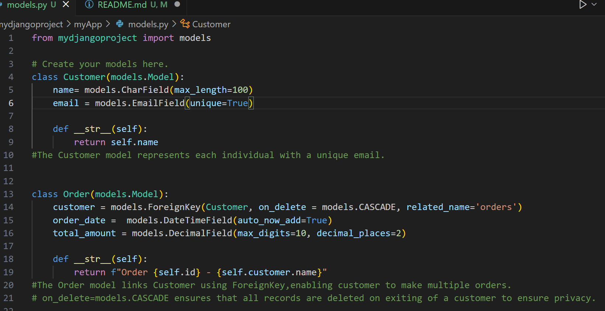

# 1. Creating the environment.

It is important to use virtual environments in order to isolate projects and make them independent.

This project is an example of an E-Commerce Company. The code shows the following:
 * Setting up the virtual environment.
 * Creating models for customers and their orders.
 * Defining the relationship between the two. This entails the customer's details like the name and email. It also includes the order date and total amount required.

# 2. Running the project.
## Example of the code on how to create the models.

## Want to make it for your own benefit??
Since this is just an example,know that it is not fully coded and is just a starter for the code.
You could use it to tweak it to your preference.